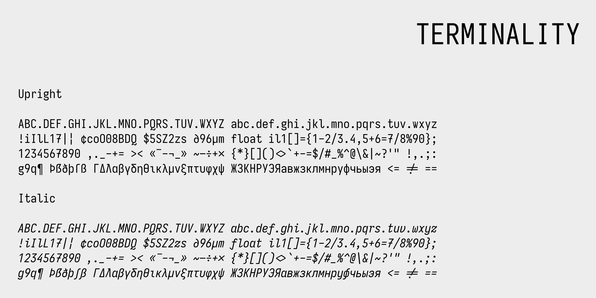

# Terminality

A custom monospace font based on Iosevka, tailored for JetBrains Mono enthusiasts with personalized stylistic enhancements.

## Overview

Terminality is a customized version of the Iosevka typeface, featuring specific design adjustments and optimizations for programming use. This font combines the best aspects of JetBrains Mono and Iosevka with personal stylistic preferences.

## Features

### Custom Glyph Designs:
Modified characters include:
  - Distinct `1` (no base)
  - Curved `7` with crossbar
  - Specialized `g`, `G`, `q`, `Q`, and many other characters
  - Custom Greek letter designs
  - Enhanced punctuation and symbols

### Optimized Ligatures:
Carefully selected programming ligatures with
  - Special handling for operators (`<=`, `>=`, `=!=`)
  - Center-aligned operators
  - Disabled unnecessary ligatures for cleaner code display

### Multiple Weights & Styles
Light (300), Regular (400), Bold (700), uright and italic (12.4° angle):

Normal and Extended widths

**Metric Optimizations**:
  - Custom x-height (540 units)
  - Adjusted character spacing for terminal use

## Demo

### Light themes

### Dark themes

## Installation

> [!IMPORTANT]
> Download the latest release from the [Releases page](https://github.com/ogswag/Terminality/releases) and install the font files to your system.

## License

- The font software is licensed under the [SIL Open Font License, Version 1.1](http://scripts.sil.org/OFL)
- The build configuration and scripts are licensed under the MIT License

## Acknowledgments

- Original Iosevka typeface by Belleve Invis
- JetBrains Mono - for being exceptionally well designed
- Custom modifications by Alexander Zakharov (me)

## Contributing

Contributions and suggestions are welcome! Please open an issue or pull request to discuss changes.
